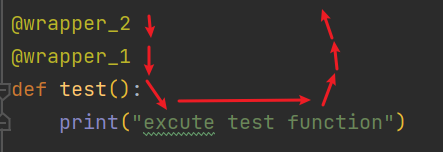

<!-- TOC -->

- [1. 函数多返回值](#1-函数多返回值)
- [2. 函数参数](#2-函数参数)
  - [2.1. 位置参数](#21-位置参数)
  - [2.2. 默认(缺省)参数](#22-默认缺省参数)
  - [2.3. 可变参数](#23-可变参数)
  - [2.4. 关键字参数](#24-关键字参数)
  - [2.5. 命名关键字参数](#25-命名关键字参数)
  - [2.6. 不定长参数](#26-不定长参数)
    - [2.6.1. 位置传递](#261-位置传递)
    - [2.6.2. 关键字传递](#262-关键字传递)
- [3. 类型注解: 对函数的参数和返回值进行指定类型和检查](#3-类型注解-对函数的参数和返回值进行指定类型和检查)
  - [3.1. 变量类型注解格式](#31-变量类型注解格式)
    - [3.1.1. 基础容器类型注解](#311-基础容器类型注解)
    - [3.1.2. `tuple、dict`详细注解](#312-tupledict详细注解)
  - [3.2. 函数（方法）类型注解](#32-函数方法类型注解)
  - [3.3. `Union`类型](#33-union类型)
- [4. `lambda`匿名函数](#4-lambda匿名函数)
  - [4.1. 格式: `lambda 传入参数: 函数体(一行代码)`](#41-格式-lambda-传入参数-函数体一行代码)
  - [4.2. 调用方法](#42-调用方法)
    - [4.2.1. 变量接收](#421-变量接收)
    - [4.2.2. (lambda)(parameter)](#422-lambdaparameter)
    - [4.2.3. 作参数](#423-作参数)
    - [4.2.4. 作返回值](#424-作返回值)
- [5. 过滤函数 `filter(function, iterable)`](#5-过滤函数-filterfunction-iterable)
- [6. 映射函数`map(function, iterable)`](#6-映射函数mapfunction-iterable)

<!-- /TOC -->

## 1. 函数多返回值

```python
def multiple_return_values():
    return 1, 'ZeirSor', True, [1, 2, 3]

x, y, z, w = multiple_return_values()
```

## 2. 函数参数

### 2.1. 位置参数
普通，略
### 2.2. 默认(缺省)参数
`参数名=默认值`
```python
def add(x, y=3):
    return x + y

print(add(1))  # 4
print((add(1, 5)))  # 6
```
- 默认参数必须在最右端
- 定义默认参数时一定要使用**不可变对象**
### 2.3. 可变参数
`*参数`
- 方便进行参数个数未知时的调用。
- 可变参数将以`tuple`形式传递。
- 只能放在最右边的参数
```python
list_example = {1, 2, 3, 4, 5}

def get_sum(*num):
    sum = 0
    for x in num:
        sum += x
    return sum

print(get_sum(1, 2, 3))  # 6
print(get_sum(*list_example))  # 15
```

### 2.4. 关键字参数
`**kw`
- 关键字参数则是以dict形式传递。 
- 关键字参数传递的是参数名:参数值键值对。
- 只能放在最右边的参数
- 关键字参数可以不用一一对应,指定即可
```python
def personinfo(name, age, **kw):
    print('name:', name, 'age:', age, 'ps:', kw)

personinfo('Steve', 22)
personinfo('Lily', 23, city='Shanghai')
personinfo('Leo', 23, gender='male', city='Shanghai')
# name: Steve age: 22 ps: {}
# name: Lily age: 23 ps: {'city': 'Shanghai'}
# name: Leo age: 23 ps: {'gender': 'male', 'city': 'Shanghai'}
```

### 2.5. 命名关键字参数
`*`

- `*`后面的参数被视为命名关键字参数。
- 命名关键字参数必须传入参数名
```python
def personinfo(name, age, *, gender, city):  # 只能传递gender和city参数
    print(name, age, gender, city)

personinfo('Steve', 22, gender='male', city='shanghai')
# Steve 22 male shanghai
```

### 2.6. 不定长参数

#### 2.6.1. 位置传递
- `args`收集参数,合并为元组

```python
def variable_length_parameter_position(*args):
    print(args)

variable_length_parameter_position(1, 2, 3, 4, 'sda', [2, 3, 4])
# (1, 2, 3, 4, 'sda', [2, 3, 4])
```

#### 2.6.2. 关键字传递
- 键=值
```python
def variable_length_parameter_keys(**kwargs):
    print(kwargs)

variable_length_parameter_keys(wo=5, ni=6, ta=7)
# {'wo': 5, 'ni': 6, 'ta': 7}
```

## 3. 类型注解: 对函数的参数和返回值进行指定类型和检查

### 3.1. 变量类型注解格式

`变量: 类型`

`变量 ... 		# type: ...`

#### 3.1.1. 基础容器类型注解

`变量名: 类型 = ...`

#### 3.1.2. `tuple、dict`详细注解

`变量名: 类型[类型, 类型, (...), ...] = ...`

### 3.2. 函数（方法）类型注解

```python
def 函数方法名(形参: 类型, ..., 形参: 类型) -> 返回值类型:
    ...
```

```python
def my_add(x: int, y: int = 8) -> int:
    return x + y

print(my_add(1)) #9
help(my_add)
```

### 3.3. `Union`类型
```python
from typing import Union

# Union[类型, 类型, ..., 类型]

my_list: list[Union[str, int]] = [1, 2, "str1", "str2"]

my_dict: dict[str, Union[str, int]] = {"name": "zhangsan", "age": 18}

# 函数注解也可...
```


## 4. `lambda`匿名函数
- 只能临时使用一次
### 4.1. 格式: `lambda 传入参数: 函数体(一行代码)`
- 只能写一行代码!

### 4.2. 调用方法

#### 4.2.1. 变量接收
```python
f = lambda x, y: x + y
print(f(2, 3)) # 5
```

#### 4.2.2. (lambda)(parameter)
```python
print((lambda x, y: x + y)(3, 4)) # 7
```

#### 4.2.3. 作参数
```python
my_list = ['wo si zs', 'a an i u y t', 'hui dss']
my_list.sort(key=lambda str: len(str.split()))
print(my_list)
# ['hui dss', 'wo si zs', 'a an i u y t']
```

#### 4.2.4. 作返回值
```python
def f(a, b, c):
    return lambda x: a * x ** 2 + b * x + c

g = f(2, 2, 1)

print(g(3))  # 25
```

## 5. 过滤函数 `filter(function, iterable)`

- `function`: 提供过滤规则的函数
- `iterable`: 可迭代对象

```python
def func(x):
    return x > 5

data = [4, 6, 7, 2, 9, 8, 0, 1, 11, 45, 2]
filtered = filter(func, data)
filtered_data = list(filtered)
print(filtered_data)
# [6, 7, 9, 8, 11, 45]
```

`lambda表达式写法`

```python
print(list(filter(lambda x: x > 5, [4, 6, 7, 2, 9, 8, 0, 1, 11, 45, 2])))
```

## 6. 映射函数`map(function, iterable)`

- `function`: 提供规则的函数对象
- `iterable`: 可迭代对象

```python
def func(x):
    return x * 2

data = [4, 6, 7, 2, 9, 8, 0, 1, 11, 45, 2]
mapped = map(func, data)
mapped_data = list(mapped)
print(mapped_data)
# [8, 12, 14, 4, 18, 16, 0, 2, 22, 90, 4]
```

`lambda表达式写法`

```python
print(list(map(lambda x: x * 2, [4, 6, 7, 2, 9, 8, 0, 1, 11, 45, 2])))

```

## 高阶函数
- 高阶函数
    -   函数接受的参数是一个函数名或者多个函数名
    -   函数的返回值是一个函数名
- 函数名的本质：地址
- e.g. 定义一个高阶函数, 实现加,减,乘,除计算器功能;
```python
def add(x, y):
    return x + y


def minus(x, y):
    return x - y


def multiply(x, y):
    return x * y


def divide(x, y):
    return x / y


def calc(x, operation, y):
    return operation(x, y)


if __name__ == '__main__':
    print(calc(1, add, 2))
    print(calc(1, minus, 2))
    print(calc(1, multiply, 2))
    print(calc(1, divide, 2))
```

## 闭包（Closure）
- 内层函数引用外层函数非全局变量（自由变量），自由变量不会在内存中消失
- 作用：保证数据安全
```python
def outer(func):
	def inner():
		func
	return inner
```

## 装饰器

`@functionName`

### 被修饰的函数中有参数


```python
def outer(func):
    def inner(*args, **kwargs):
    	ret = func(*args, **kwargs)
    	return ret
    return inner
	
@outer  # <=> func = outer(func)
def func():
	pass
	
func()  # <=> outer(func)()
```

### 带参数的装饰器

#### 让函数重复执行

```python
# 默认循环执行3次
def repeat_execute(count=3):
    def outer(func):
        def inner(*args, **kwargs):
            sum = 0
            for _ in range(count):
                sum += func(*args, **kwargs)
            return sum

        return inner

    return outer


@repeat_execute()
def add(x, y):
    return x + y


if __name__ == '__main__':
    # 循环加了三次 结果为9
    print(add(1, 2))
```

#### 测试代码1

```python
def outer(a=1, b=2):
	def inner2(func):
        def inner(*args, **kwargs):
            ret = func(*args, **kwargs)
            return ret
		return inner
    return inner2
	
@outer(1, 2)  # <=> func = outer(1, 2)(func)
def func():
	pass
	
func()
```

#### 测试代码2

```python
def calc_time(r=2):
    def outer(f):
        def inner(*args, **kwargs):
            start_time = time.time()
            res = f(*args, **kwargs)
            end_time = time.time()
            print("-----")
            print(round(end_time - start_time, r))
            return res

        return inner

    return outer


@calc_time(5)
def stop():
    time.sleep(random.uniform(0, 2))
    # print(args)


# stop = calc_time(r=2)(stop)

@calc_time()
def add(x, y):
    return x + y


if __name__ == '__main__':
    # stop()  # calc_time(r=2)(stop)()
    print(add(1.1234, 2.4357))
    print(calc_time(5)(add)(1, 2))
```

### 伪应用场景

#### 登录认证

```python
from flask import Flask

app = Flask(__name__)


def auth(func):
    def inner(*args, **kwargs):
        # 伪代码
        # 先判断用户是否已经登录 未登录则返回登陆页面 以登录则继续往下走
        res = func(*args, **kwargs)
        return res

    return inner


@auth
def index():
    return "首页"


@auth
def info():
    return "用户中心"


@auth
def order():
    return "订单中心"


def login():
    return "登录页面"


app.add_url_rule("/index/", view_func=index)
app.add_url_rule("/info/", view_func=info)
app.add_url_rule("/order/", view_func=order)
app.add_url_rule("/login/", view_func=login)

app.run()
```

#### 面向对象

#### flask路由都是有参装饰器

### 重要补充`functools`

-   `funcName.__name__` 查看函数名
-   `funcName.__doc__` 查看函数文档注释

不改变函数名和文档注释

```python
import functools


def auth(func):
    @functools.wraps(func)  # <=> inner.__name = func.__name__  &&  inner.__doc__ = inner.__doc__
    def inner(*args, **kwargs):
        """this is inner function in auth function"""
        res = func(*args, **kwargs)
        return res

    return inner


@auth  # admin = auth(admin)
def admin():
    """this is admin function"""
    print("this is admin function")


if __name__ == '__main__':
    print(admin.__name__)  # admin
    print(admin.__doc__)  # this is admin function
```

#### **标准写法！**

```python
import functools
def auth(func):
    @functools.wraps(func)  # <=> inner.__name = func.__name__  &&  inner.__doc__ = inner.__doc__
    def inner(*args, **kwargs):
        """this is inner function in auth function"""
        res = func(*args, **kwargs)
        return res
    return inner
```

### 多个装饰器装饰一个函数

-   先执行离被装饰函数最近的装饰器



-   装饰器

```python
def wrapper_1(func):
    def inner_1(*args, **kwargs):
        print("wrapper_1 start")
        ret = func(*args, **kwargs)
        print("wrapper_1 end")
        return ret
    return inner_1
def wrapper_2(func):
    def inner_2(*args, **kwargs):
        print("wrapper_2 start")
        ret = func(*args, **kwargs)
        print("wrapper_2 end")
        return ret
    return inner_2
```

-   测试函数

```python
@wrapper_2
@wrapper_1
def test():
    print("excute test function")
```

-   输出结果

```python
test()
# wrapper_2 start
# wrapper_1 start
# excute test function
# wrapper_1 end
# wrapper_2 end
```

