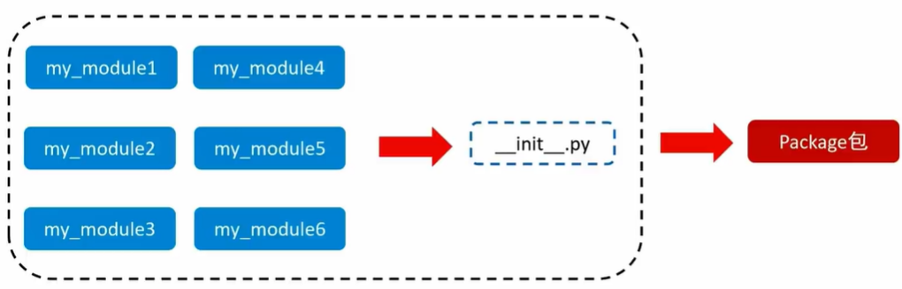

# 模块和包
<!-- TOC -->

- [1. 模块](#1-模块)
	- [1.1. 模块的导入方式](#11-模块的导入方式)
		- [1.1.1. `[from 模块名] import [模块|类 |变量 |函数｜＊]　［as 别名］`](#111-from-模块名-import-模块类-变量-函数as-别名)
		- [1.1.2. 常用组合](#112-常用组合)
	- [1.2. 自定义模块](#12-自定义模块)
		- [1.2.1. 注意](#121-注意)
		- [1.2.2. `__name__`变量](#122-__name__变量)
		- [1.2.3. `__all__`变量](#123-__all__变量)
- [2. 包](#2-包)
	- [2.1. `__init__.py 文件`](#21-__init__py-文件)
	- [2.2. 导入包](#22-导入包)

<!-- /TOC -->
## 1. 模块

### 1.1. 模块的导入方式

#### 1.1.1. `[from 模块名] import [模块|类 |变量 |函数｜＊]　［as 别名］`  
-   `[]`为可省略内容

#### 1.1.2. 常用组合
- `import 模块名1, 模块名2, ...`
	- 用法: `模块名.功能名()`
- `from 模块名 import 类、变量、方法等`
- `from 模块名 import * `
	- 与`import 模块名`区别在于: `from 模块名 import *`可用直接调用类、变量、方法等，不用`模块名.`
- `import 模块名 as 别名`
- `from 模块名 import 功能名 as 别名`

### 1.2. 自定义模块
#### 1.2.1. 注意
- 自定义模块里调用了里面的方法,再导入模块的时候会执行该方法
#### 1.2.2. `__name__`变量
- `if __name__ == '__main__':`只有当程序直接执行时才会进入`if`内部, 导入则不会进入`if`内部
- `if __name__ == '__main__'`用于测试功能
#### 1.2.3. `__all__`变量
- `__all__`变量是一个**列表**
- 当使用`from xxx import *`时, 只能导入该列表中的元素
- `__all__`只作用再`*`

## 2. 包



### 2.1. `__init__.py 文件`
- 通过`__all__`变量控制`import *`的行为
### 2.2. 导入包
略


## 内置模块 Built-in modules

### logging

[python 日志 logging模块(详细解析)](https://blog.csdn.net/pansaky/article/details/90710751)

-   日志，记录程序的相关信息
-   级别
    -   `info` 没有任何问题
    -   `debug` 没有任何问题
    -   `warning` 可以去做也可以不去做
    -   `error` 必须得做
    -   `critical` 程序崩溃

#### V1 打印日志

```python
logging.info()
logging.debug()
logging.warning()
logging.error()
logging.critical()
```

```
1.把日志保存到文件中
2.info的信息也要记录下来
```

#### V2 基本配置

```python
logging.basicConfig(filename='log.txt',  # 指定日志保存的文件名
                    format='%(asctime)s - %(name)s - %(levelname)s - %(message)s',  # 指定日志的格式
                    datefmt='%Y-%m-%d %H:%M:%S %p',  # 时间
                    level=10)  # 控制保存的最低等级
```

```python
1.对于不同的项目需要弄不同，不灵活
2.一直往文件写入，不可控，不能打印
3.参数全部固定不变的
```

`format`参数

```python
参数：作用
 
%(levelno)s：打印日志级别的数值
%(levelname)s：打印日志级别的名称
%(pathname)s：打印当前执行程序的路径，其实就是sys.argv[0]
%(filename)s：打印当前执行程序名
%(funcName)s：打印日志的当前函数
%(lineno)d：打印日志的当前行号
%(asctime)s：打印日志的时间
%(thread)d：打印线程ID
%(threadName)s：打印线程名称
%(process)d：打印进程ID
%(message)s：打印日志信息
```

#### V3 自定义

```python
1.ogger你是哪个版本的日志I
2.fi1ter,不用管
3.hand1er,是保存在文件中，还是打印到屏幕里
4.formatter,控制日志的格式
```

```python
    import logging
    # 1.ogger你是哪个版本的日志I
    logger = logging.getLogger("bank")
    # 2.fi1ter,不用管
    # 3.hand1er,是保存在文件中，还是打印到屏幕里
    t1 = logging.FileHandler('t1.log') # 往文件中打印
    t2 = logging.FileHandler('t2.log') # 往文件中打印
    sm = logging.StreamHandler()
    # 4.formatter,控制日志的格式
    formmater1 = logging.Formatter('%(asctime)s - %(name)s - %(levelname)s -%(module)s:  %(message)s',
                                   datefmt='%Y-%m-%d %H:%M:%S %p', )
    formmater2 = logging.Formatter('%(asctime)s :  %(message)s',
                                   datefmt='%Y-%m-%d %H:%M:%S %p', )
    formmater3 = logging.Formatter('%(name)s %(message)s', )
    # 5.把formatter绑定到handler里面去
    t1.setFormatter(formmater1)
    t2.setFormatter(formmater2)
    sm.setFormatter(formmater3)

    # 6.handler绑定到logger里面去
    logger.addHandler(t1)
    logger.addHandler(t2)
    logger.addHandler(sm)

    # 7.设置打印级别
    # logger.setLevel(10) # 先设置全部， 再设置单个  不设置默认30  必须设置
    t1.setLevel(20)
    t2.setLevel(30)
    sm.setLevel(40)

    # 8.测试
    logger.info('123')
    logger.debug('123')
    logger.warning('123')
    logger.error('123')
    logger.critical('123')
```

#### 项目结构

```PYTHON
─project_template
│  ├─conf
│  │  │  settings.py
│  │
│  ├─core
│  │      bank.py
│  │      project.py
│  │      user.py
│  │
│  ├─lib
│  │  │  common.py
│  │
│  └─log
│          log.log
```

`settings`模板

```python
#!/usr/bin/python3
# -*- coding: utf-8 -*-
import os
import logging.config

# 定义三种日志输出格式 开始
standard_format = '[%(asctime)s][%(threadName)s:%(thread)d][task_id:%(name)s][%(filename)s:%(lineno)d]' \
                  '[%(levelname)s][%(message)s]'  # 其中name为getLogger()指定的名字；lineno为调用日志输出函数的语句所在的代码行
simple_format = '[%(levelname)s][%(asctime)s][%(filename)s:%(lineno)d]%(message)s'
id_simple_format = '[%(levelname)s][%(asctime)s] %(message)s'
# 定义日志输出格式 结束

logfile_dir = os.path.dirname(os.path.dirname(os.path.abspath(__file__)))  # log文件的目录，需要自定义文件路径 # project_template
logfile_dir = os.path.join(logfile_dir, 'log')  # E:\ncepu\ncepu-python\project_template\log

logfile_name = 'log.log'  # log文件名，需要自定义路径名

# 如果不存在定义的日志目录就创建一个
if not os.path.isdir(logfile_dir):  # E:\ncepu\ncepu-python\project_template\log
    os.mkdir(logfile_dir)

# log文件的全路径
logfile_path = os.path.join(logfile_dir, logfile_name)  # E:\ncepu\ncepu-python\project_template\log\log.log
# 定义日志路径 结束

# log配置字典
LOGGING_DIC = {
    'version': 1,
    'disable_existing_loggers': False,
    'formatters': {
        'standard': {
            'format': standard_format
        },
        'simple': {
            'format': simple_format
        },
    },
    'filters': {},  # filter可以不定义
    'handlers': {
        # 打印到终端的日志
        'console': {
            'level': 'DEBUG',
            'class': 'logging.StreamHandler',  # 打印到屏幕
            'formatter': 'simple'
        },
        # 打印到文件的日志,收集info及以上的日志
        'default': {
            'level': 'INFO',
            'class': 'logging.handlers.RotatingFileHandler',  # 保存到文件
            'formatter': 'standard',
            'filename': logfile_path,  # 日志文件
            'maxBytes': 1024 * 1024 * 5,  # 日志大小 5M  (*****)
            'backupCount': 5,
            'encoding': 'utf-8',  # 日志文件的编码，再也不用担心中文log乱码了
        },
    },
    'loggers': {
        # logging.getLogger(__name__)拿到的logger配置。如果''设置为固定值logger1，则下次导入必须设置成logging.getLogger('logger1')
        '': {
            # 这里把上面定义的两个handler都加上，即log数据既写入文件又打印到屏幕
            'handlers': ['default', 'console'],
            'level': 'DEBUG',
            'propagate': False,  # 向上（更高level的logger）传递
        },
    },
}

if __name__ == '__main__':
    load_my_logging_cfg()
```

`common`模板

```python
#!/usr/bin/python3
# -*- coding: utf-8 -*-
import logging
from conf.settings import LOGGING_DIC

def load_my_logging_cfg(name):
    logging.config.dictConfig(LOGGING_DIC)  # 导入上面定义的logging配置
    logger = logging.getLogger(name)  # 生成一个log实例
    logger.info('It works!')  # 记录该文件的运行状态

    return logger
```

