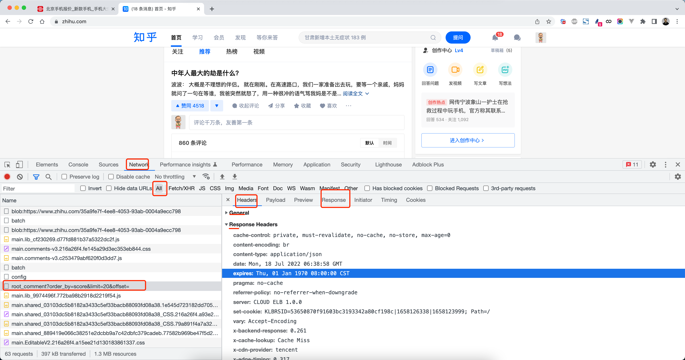
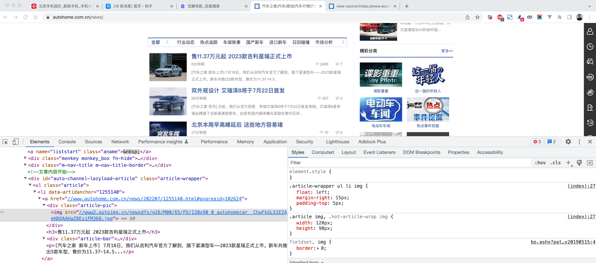
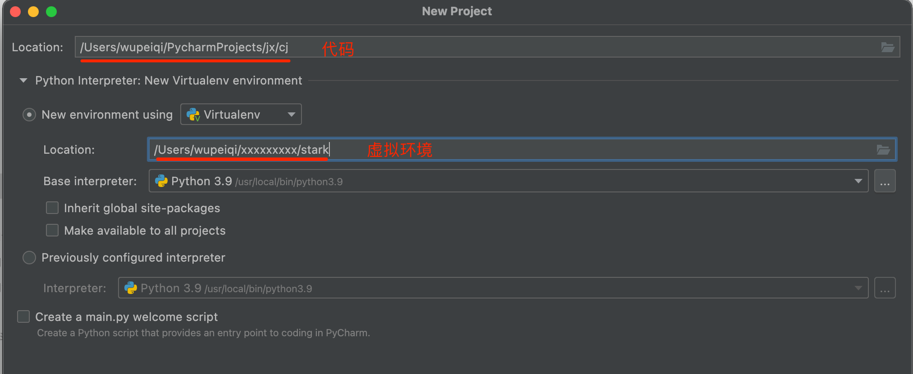
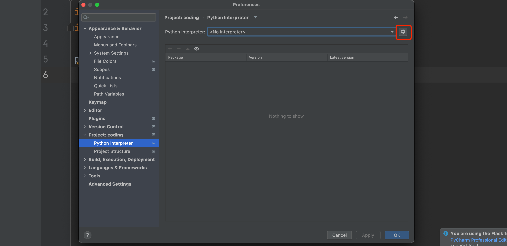
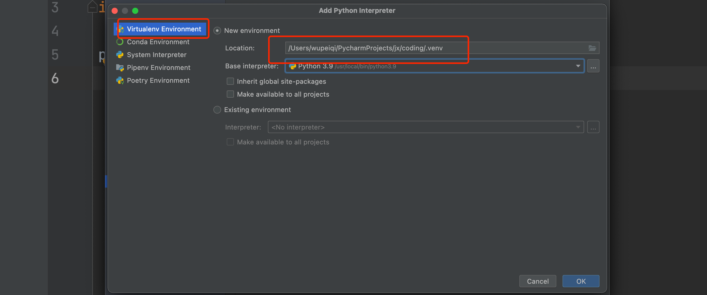
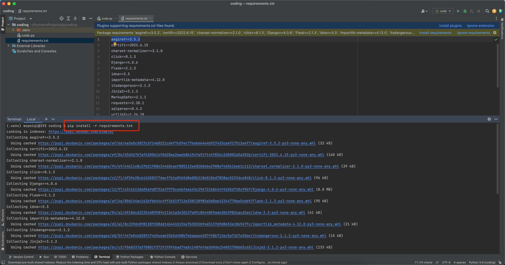

# 模块和包
<!-- TOC -->

- [1. 模块](#1-模块)
  - [1.1. 模块都是从哪里导入的？](#11-模块都是从哪里导入的)
  - [1.2. 模块的导入方式](#12-模块的导入方式)
    - [1.2.1. `[from 模块名] import [模块|类 |变量 |函数｜＊]　［as 别名］`](#121-from-模块名-import-模块类-变量-函数as-别名)
    - [1.2.2. 常用组合](#122-常用组合)
  - [1.3. 自定义模块](#13-自定义模块)
    - [1.3.1. 注意](#131-注意)
    - [1.3.2. `__name__`变量](#132-__name__变量)
    - [1.3.3. `__all__`变量](#133-__all__变量)
- [2. 包](#2-包)
  - [2.1. `__init__.py 文件`](#21-__init__py-文件)
  - [2.2. 导入包](#22-导入包)
- [3. 内置模块 Built-in modules](#3-内置模块-built-in-modules)
  - [3.1. random](#31-random)
    - [3.1.1. 案例：年会抽奖](#311-案例年会抽奖)
  - [3.2. hashlib](#32-hashlib)
    - [3.2.1. 撞库](#321-撞库)
    - [3.2.2. 加盐](#322-加盐)
    - [3.2.3. 案例：用户注册+写入文件](#323-案例用户注册写入文件)
    - [3.2.4. 案例：用户注册+写入文件](#324-案例用户注册写入文件)
  - [3.3. 序列化相关](#33-序列化相关)
    - [3.3.1. json](#331-json)
      - [3.3.1.1. 中文](#3311-中文)
      - [3.3.1.2. 序列化支持类型](#3312-序列化支持类型)
      - [3.3.1.3. 案例：获取豆瓣电影](#3313-案例获取豆瓣电影)
      - [3.3.1.4. 案例：小网站给别人提供数据](#3314-案例小网站给别人提供数据)
  - [3.4. 时间相关](#34-时间相关)
    - [3.4.1. time](#341-time)
    - [3.4.2. datetime](#342-datetime)
    - [3.4.3. 案例：用户注册&存储文件&注册时间](#343-案例用户注册存储文件注册时间)
    - [3.4.4. 案例：日志写入到不同文件，按天来分割。](#344-案例日志写入到不同文件按天来分割)
    - [3.4.5. 时间格式的相互转换：](#345-时间格式的相互转换)
    - [3.4.6. 案例：考勤](#346-案例考勤)
  - [3.5. os](#35-os)
    - [3.5.1. 案例：用户注册](#351-案例用户注册)
    - [3.5.2. 案例：景区订票系统](#352-案例景区订票系统)
  - [3.6. sys](#36-sys)
  - [3.7. shutil](#37-shutil)
  - [3.8. logging](#38-logging)
    - [3.8.1. V1 打印日志](#381-v1-打印日志)
    - [3.8.2. V2 基本配置](#382-v2-基本配置)
    - [3.8.3. V3 自定义](#383-v3-自定义)
    - [3.8.4. 项目结构](#384-项目结构)

<!-- /TOC -->
## 1. 模块

### 1.1. 模块都是从哪里导入的？

在导入模块时，Python默认会去固定的几个位置寻找。

```
E:/ncepu/ncepu-python/import_modules_test/shutileDemo.py 
E:\ncepu\ncepu-python\import_modules_test
E:\ncepu\ncepu-python
E:\ncepu\ncepu-python\project_template
C:\Program Files\JetBrains\PyCharm 2022.2\plugins\python\helpers\pycharm_display
C:\Users\ASUS\.conda\envs\python_learning\python39.zip
C:\Users\ASUS\.conda\envs\python_learning\DLLs
C:\Users\ASUS\.conda\envs\python_learning\lib
C:\Users\ASUS\.conda\envs\python_learning
C:\Users\ASUS\.conda\envs\python_learning\lib\site-packages
C:\Program Files\JetBrains\PyCharm 2022.2\plugins\python\helpers\pycharm_matplotlib_backend
```

```
- 当前py文件（脚本）所在目录中。
- 内置模块中找
- site-packages中
```

如果要导入的模块不在当前脚本文件所在目录，可以通过`sys.path.append(path)`的方式取添加模块搜索路径。

### 1.2. 模块的导入方式

#### 1.2.1. `[from 模块名] import [模块|类 |变量 |函数｜＊]　［as 别名］`  
-   `[]`为可省略内容

#### 1.2.2. 常用组合
- `import 模块名1, 模块名2, ...`
	- 用法: `模块名.功能名()`
- `from 模块名 import 类、变量、方法等`
- `from 模块名 import * `
	- 与`import 模块名`区别在于: `from 模块名 import *`可用直接调用类、变量、方法等，不用`模块名.`
- `import 模块名 as 别名`
- `from 模块名 import 功能名 as 别名`
- `from . import xxx` 相对导入, 要在文件夹中使用,文件夹中的模块又相互依赖关系, 使用相对导入的模块不能直接运行测试, 可以在debug的时候测试.

### 1.3. 自定义模块
#### 1.3.1. 注意
- 自定义模块里调用了里面的方法,再导入模块的时候会执行该方法
- 注意：我们的文件名不要和内置和第三方的同名。
#### 1.3.2. `__name__`变量
- `if __name__ == '__main__':`只有当程序直接执行时才会进入`if`内部, 导入则不会进入`if`内部
- `if __name__ == '__main__'`用于测试功能
#### 1.3.3. `__all__`变量
- `__all__`变量是一个**列表**
- 当使用`from xxx import *`时, 只能导入该列表中的元素
- `__all__`只作用再`*`

## 2. 包


### 2.1. `__init__.py 文件`
- 通过`__all__`变量控制`import *`的行为
### 2.2. 导入包
略


## 3. 内置模块 Built-in modules

### 3.1. random

```python
import random

# 1.随机整数
v1 = random.randint(10, 20)
print(v1)

# 2.随机小数
v2 = random.uniform(0, 1)
print(v2)

# 3.随机选择一个数
v3 = random.choice([11, 22, 33, 44])
print(v3)

# 4.随机选择多个数
v4 = random.sample([11, 22, 33, 44], 2)
print(v4)  # [11, 33]

# 5.打乱顺序
num_list = [1, 99, 12, 88, 1111]
random.shuffle(num_list)
print(num_list)
```

```python
import random

v1 = random.randint(65, 90)
data = chr(v1)
print(data)
```

-   生成随机字母

```python
import random
import string

data = random.choice(string.ascii_letters)
print(data)
```

#### 3.1.1. 案例：年会抽奖

```
# 1.创建300个员工，工号： user = ["用户-1","用户-2",...,"用户-300",]    -> 推导式生成

# 2.奖项和人数
data_list = [
	("三等奖",5,"赠送ipad"),
	("二等奖",3,"赠送iphone 14"),
	("一等奖",1,"马尔代夫"),
	("特等奖",1,"一套房"),
]

# 3.抽奖，抽取指定的数量  x = [,,,,]   ->  "恭喜：xx、xxx、xxx获得三等奖"

# 注意：参与过抽奖的人，不能再参与。
```

```python
import random

# 1.创建300个员工
users = ["员工-{}".format(i) for i in range(1, 301)]

# 2.奖项和人数
data_list = [
    ("三等奖", 5, "赠送ipad"),
    ("二等奖", 3, "赠送iphone 14"),
    ("一等奖", 1, "马尔代夫"),
    ("特等奖", 1, "一套房"),
]

# 3.抽奖
for title, count, detail in data_list:
    input(">>>")

    # 3.1 抽人  ["xx","xx"]
    lucky_list = random.sample(users, count)

    # 3.2 剔除
    for name in lucky_list:
        users.remove(name)

    # 3.3 展示信息
    message = "恭喜：{}获得{}，奖品是：{}".format("、".join(lucky_list), title, detail)
    print(message)
```

### 3.2. hashlib

基于此模块可以实现md5加密。

```python
import hashlib

data = "admin"

obj = hashlib.md5()
obj.update(data.encode('utf-8'))
res = obj.hexdigest()
print(res) # 21232f297a57a5a743894a0e4a801fc3
```

为什么要加密？

```
wupeiqi,admin
```

```
# 注册时，wupeiqi  admin
# 登录时，wupeiqi  admin->加密 21232f297a57a5a743894a0e4a801fc3
wupeiqi,21232f297a57a5a743894a0e4a801fc3
```

md5是没办法解密，别不信。

#### 3.2.1. 撞库

```python
admin   	21232f297a57a5a743894a0e4a801fc3
root	    .... 
123123      ...
...
```

#### 3.2.2. 加盐

```python
import hashlib

data = "admin"

obj = hashlib.md5("asdfasdfasdfasdfa3exc".encode('utf-8'))
obj.update(data.encode('utf-8'))
res = obj.hexdigest()
print(res) # 31e6d3515f3380198e95b4bf83e5c4ee
```

#### 3.2.3. 案例：用户注册+写入文件

```python
import hashlib

# 1.输入
user = input("输入用户名：")
pwd = input("输入密码：")

# 2.加密密码
obj = hashlib.md5("asdfasdfasdfasdfa3exc".encode('utf-8'))
obj.update(pwd.encode('utf-8'))
password = obj.hexdigest()

# 3.写入文件
with open("db.txt", mode='a', encoding='utf-8') as f:
    line = "{}|{}\n".format(user, password)
    f.write(line)
```

#### 3.2.4. 案例：用户注册+写入文件

```python
import hashlib

DB_FILE_PATH = "db.txt"

def md5(data_string):
    obj = hashlib.md5("asdfasdfasdfasdfa3exc".encode('utf-8'))
    obj.update(data_string.encode('utf-8'))
    return obj.hexdigest()

def register():
    # 1.输入
    user = input("输入用户名：")
    pwd = input("输入密码：")

    # 2.加密
    password = md5(pwd)

    # 3.写入文件
    with open(DB_FILE_PATH, mode='a', encoding='utf-8') as f:
        line = "{}|{}\n".format(user, password)
        f.write(line)

def login():
    user = input("用户名：")
    pwd = input("密码：")
    password = md5(pwd)

    is_success = False
    with open(DB_FILE_PATH, mode='r', encoding='utf-8') as f:
        for line in f:
            line = line.strip()
            db_user, db_pwd = line.split('|')
            if db_user == user and db_pwd == password:
                is_success = True
                break

    if is_success:
        print("登录成功")
    else:
        print("登录失败")

def run():
    func_dict = {
        "1": register,
        "2": login
    }

    print("1.注册  2.登录")
    choice = input("序号：")
    func = func_dict.get(choice)
    if not func:
        print("输入错误")
    else:
        func()

if __name__ == '__main__':
    run()
```

### 3.3. 序列化相关

#### 3.3.1. json

本质：是一个字符串，有一些特定的格式。

价值：每一种编程语言中都可以有这种格式实现数据传输。

- 序列化，Python数据类型 -> JSON格式字符串

```python
  info = {'code': 100, "data": [11, 22, 33]}
  import json
  data_string = json.dumps(info)
  print(data_string)  # '{"code": 100, "data": [11, 22, 33]}'
```

- 反序列化，  JSON格式字符串 -> Python数据类型

```python
data_string = '{"code": 100, "data": [11, 22, 33]}'
import json
info = json.loads(data_string)
print(info)
print(info['code'])
```

常见的json格式：

```python
v1 = '{"k1":123,"k2":456}'  # 是JSON格式的字符串
v2 = "{'k1':123,'k2':456}"  # 不是JSON格式的字符串
v3 = '{"k1":123,"k2":456,"k3":[11,22,33]}'  # 是JSON格式的字符串
v4 = '{"k1":123,"k2":456,"k3":(11,22,33)}'  # 不是JSON格式的字符串

v5 = '{"k1": 123, "k2": 456, "status": true}' # 是JSON格式的字符串
v6 = '{"k1": 123, "k2": 456, "status": True}' # 不是JSON格式的字符串


v7 = '{"name": "武沛齐", "k2": 456, "status": true, "data": null}'  # 是JSON格式的字符串
v8 = '{"name": "武沛齐", "k2": 456, "status": true, "data": None}'  # 不是JSON格式的字符串
```

##### 3.3.1.1. 中文

```python
info = {"name": "武沛齐", "k2": 456, "status": True}

import json

res = json.dumps(info, ensure_ascii=False)
print(res)  # {"name": "武沛齐", "k2": 456, "status": true}
```

##### 3.3.1.2. 序列化支持类型

```
    +-------------------+---------------+
    | Python            | JSON          |
    +===================+===============+
    | dict              | object        |
    +-------------------+---------------+
    | list, tuple       | array         |
    +-------------------+---------------+
    | str               | string        |
    +-------------------+---------------+
    | int, float        | number        |
    +-------------------+---------------+
    | True              | true          |
    +-------------------+---------------+
    | False             | false         |
    +-------------------+---------------+
    | None              | null          |
    +-------------------+---------------+
```

##### 3.3.1.3. 案例：获取豆瓣电影

```python
https://movie.douban.com/j/search_subjects?type=movie&tag=%E7%83%AD%E9%97%A8&sort=recommend&page_limit=20&page_start=20
```

```python
import requests
import json

res = requests.get(
    url="https://movie.douban.com/j/search_subjects?type=movie&tag=%E7%83%AD%E9%97%A8&sort=recommend&page_limit=20&page_start=20",
    headers={
        "user-agent": "Mozilla/5.0 (Macintosh; Intel Mac OS X 10_15_7) AppleWebKit/537.36 (KHTML, like Gecko) Chrome/103.0.0.0 Safari/537.36"
    }
)
# 豆瓣返回的原始JSON格式的字符串
print(res.text)

# 反序列化为Python中的数据-> 字典
data_dict = json.loads(res.text)

# 对字典进行操作
for item in data_dict['subjects']:
    title = item['title']
    url = item['url']
    # print(title, url)
    with open('movies.txt', mode='a', encoding='utf-8') as f:
        f.write("{}|{}\n".format(title, url))
```

##### 3.3.1.4. 案例：小网站给别人提供数据

```
pip install flask
```

```python
import json
from flask import Flask

app = Flask(__name__)


@app.route('/xxxxxxx/yy')
def home():
    return "欢迎使用"


@app.route('/to/info')
def play():
    info = {"code": 1000, 'data': [11, 22, 33]}
    data_string = json.dumps(info)
    return data_string


if __name__ == '__main__':
    app.run()
```

### 3.4. 时间相关

- time
- datetime

#### 3.4.1. time

```python
import time

# 1.时间戳 （ 自1970年1月1日）
data = time.time()
print(data)  # 1657952279.8704221

# 2.主动停n秒（睡）
while True:
    print(123)
    time.sleep(5)
```

```python
import time

start = time.time()
...
....
end = time.time()

interval = end - start
print(interval)
```

#### 3.4.2. datetime

- 时间戳

```python
import time

v1 = time.time()
```

- datetime格式

```python
from datetime import datetime

data = datetime.now()
print(data)
```

```python
from datetime import datetime
from datetime import timedelta

v1 = datetime.now() - timedelta(days=50, hours=40, minutes=10, seconds=100)
print(v1)
```

- 字符串的格式的时间

```python
from datetime import datetime

v1 = datetime.now()
v2 = v1.strftime("%Y-%m-%d %H:%M:%S")

print(v2)  # "2022-07-16 14:26:25"
print(type(v2))
```

#### 3.4.3. 案例：用户注册&存储文件&注册时间

```python
from datetime import datetime

user = input("用户名：")
pwd = input("密码：")
ctime_string = datetime.now().strftime("%Y年%m月%d日")

line = "{}|{}|{}\n".format(user, pwd, ctime_string)

with open('db.txt', mode='a', encoding='utf-8') as f:
    f.write(line)
```

#### 3.4.4. 案例：日志写入到不同文件，按天来分割。

```python
from datetime import datetime

while True:
    user = input("用户名：")
    pwd = input("密码：")

    line = "{}|{}\n".format(user, pwd)

    ctime_string = datetime.now().strftime("%Y-%m-%d-%H-%M-%S")
    file_name = "{}.txt".format(ctime_string)

    with open(file_name, mode='a', encoding='utf-8') as f:
        f.write(line)
```

#### 3.4.5. 时间格式的相互转换：

- 字符串 -> datetime类型

```python
text = "2022-01-12"

from datetime import datetime

res = datetime.strptime(text, "%Y-%m-%d")
print(res)
```

- datetime类型 -> 字符串

```python
from datetime import datetime

res = datetime.now().strftime("%Y-%m-%d")
print(res)
```

- datetime类型 -> 时间戳

```python
from datetime import datetime

v1 = datetime.now()
res = v1.timestamp()
print(res)
```

- 时间戳 - > datetime类型

```python
import time
from datetime import datetime

v1 = time.time()

res = datetime.fromtimestamp(v1)
print(res)
```


#### 3.4.6. 案例：考勤

```python
import time
from datetime import datetime

start_string = "2022-04-11 08:47"
start_date = datetime.strptime(start_string, "%Y-%m-%d %H:%M")

end_string = "2022-04-11 18:33"
end_date = datetime.strptime(end_string, "%Y-%m-%d %H:%M")

v1 = end_date - start_date
print(v1)

print(v1.seconds)
```

### 3.5. os

- 路径的拼接

```python
import os

path = os.path.join("db", 'root', "a.txt")
print(path)
```

- 上级目录

```python
import os

path = os.path.join("db", 'root', "a.txt")
print(path)  # db/root/a.txt


folder_path = os.path.dirname(path)
print(folder_path)  # db/root
```

- 项目中读取文件时，用绝对路径（file和abspath/join/dirname)

```python
import os

base_dir = os.path.dirname(os.path.abspath(__file__))
file_path = os.path.join(base_dir, 'a1.txt')

print(file_path)  # /Users/wupeiqi/PycharmProjects/jx/day06/a1.txt
```

- 判断路径是否存在

```python
v1 = os.path.exists("路径是否存在")
print(v1)
```

```
# 注意：读取文件时，如果文件路径不存在报错。一般在读取文件时，要先判断是否在。
```

- 创建文件夹

```python
os.makedirs("xxx/xxxx/xxxx")
```

```python
import os

folder_path = "xxx/xxxx/xxxx"
if not os.path.exists(folder_path):
	os.makedirs(folder_path)
```

- 判断是否是文件夹

```python
v1 = os.path.isdir(file_path)
print(v1)
```

- 删除文件和文件夹

```python
import os
os.remove(file_path)  # 删除文件
```

```python
import shutil
shutil.rmtree(db_path) # 删除文件夹
```

- 查看目录下的所有文件和文件夹（一级目录）

```python
import os

base_dir = os.path.dirname(os.path.abspath(__file__))
db_path = os.path.join(base_dir, 'db')

for name in os.listdir(db_path):
	file_path = os.path.join(db_path, name)
print(name)
print(file_path)
```

- 查看目录下的文件和文件夹（多级目录）

```python
import os

base_dir = os.path.dirname(os.path.abspath(__file__))
db_path = os.path.join(base_dir, 'db')

for in_path, folder_list, name_list in os.walk(db_path):
	for name in name_list:
		abs_path = os.path.join(in_path,name)
	print(abs_path)

```

```python
import os

base_dir = os.path.dirname(os.path.abspath(__file__))
db_path = os.path.join(base_dir, 'db')


for in_path, folder_list, name_list in os.walk(db_path):
	for name in name_list:
		if name.endswith('md'):
			abs_path = os.path.join(in_path, name)
			print(abs_path)
```

#### 3.5.1. 案例：用户注册

```python
import os
from datetime import datetime

base_dir = os.path.dirname(os.path.abspath(__file__))

# 用户名 和密码
user = input("用户名：")
password = input("密码：")
line = "{}|{}\n".format(user, password)

# 判断文件夹是否存在，不存在则创建
date_string = datetime.now().strftime("%Y-%m")
folder_path = os.path.join(base_dir, 'db', date_string)
if not os.path.exists(folder_path):
    os.makedirs(folder_path)

# 拼接文件路径
file_path = os.path.join(folder_path, 'account.txt')
with open(file_path, mode='a', encoding='utf-8') as f:
    f.write(line)

```

#### 3.5.2. 案例：景区订票系统

```
- 启动项目时，监测当前项目目录下是否有 db目录，如果没有就创建。
- 提示输入用户名，进入系统，监测 db/用户名.txt 文件
	- 存在，老用户。
	- 不存在，新用户。
- 订票
	- 输入景区：名字、数量
	- 名字、数量、预定时间 写入到 db/用户名.txt 中。
- 查看历史订单
	- 读取 db/用户名.txt的内容逐行输出。
```

```python
import os.path
from datetime import datetime

ABS_PATH_DIR = os.path.dirname(os.path.abspath(__file__))
DB_PATH = os.path.join(ABS_PATH_DIR, "db")


def booking(username, user_file_path):
    secnic_name = input("enter scenic name>>>")
    count = input("enter count>>>")
    date_string = datetime.now().strftime("%Y-%m-%d")

    line = "{}|{}|{}\n".format(secnic_name, count, date_string)
    with open(user_file_path, mode='a', encoding='utf8') as f:
        f.write(line)

    print("book successfully!")


def history(username, user_file_path):
    if not os.path.exists(user_file_path):
        print("Your current account has no historical orders!")
        return

    with open(user_file_path, mode='r', encoding='utf8') as f:
        for line in f:
            line = line.strip()
            scenic, count, date = line.split("|")
            msg = "scenic spot: {}, count: {}, book date: {}".format(scenic, count, date)
            print(msg)


def run():
    if not os.path.exists(DB_PATH):
        os.makedirs(DB_PATH)

    name = input("enter your name>>>")
    user_path_file = os.path.join(DB_PATH, "{}.txt".format(name))
    if os.path.exists(user_path_file):
        print("welcome back")
    else:
        print("welcome")

    func_dir = {
        "1": booking,
        "2": history
    }
    print("1: booking, 2: history")
    while True:
        choice = input("enter your choice>>>")
        if choice.upper() == "Q":
            break
        func = func_dir.get(choice)
        if not func:
            print("enter error, please enter again.")
            continue
        func(name, user_path_file)


if __name__ == '__main__':
    run()
```

### 3.6. sys

```python
import sys

# 1.导入模块时，都会去哪里找
print(sys.path)

# 2.sys.argv，运行脚本时传入的参数
print(sys.argv)
```

```python
import sys

#  python3.9 app.py                   ['app.py']
#  python3.9 app.py v1 "1 23" 999     ['app.py', 'v1', '1 23', '999']
# print(sys.argv)

name = sys.argv[1]
age = sys.argv[2]
token = sys.argv[3]

data_string = "{}-{}".format(name, token)
print(data_string)
```

```
>>>python3.9 app.py  wupeiqi  19  sdfasdfasdfasdf
```

### 3.7. shutil

- 删除文件夹

```python
import shutil

shutil.rmtree("文件夹的路径")
```

- 重命名

```python
import shutil

shutil.move("db.txt", 'news.txt') # 文件

shutil.move("xx", 'yy') # 文件夹
```

- 拷贝文件夹

```python
import shutil

shutil.copytree("yy", "db/yy")
```

- 拷贝文件

```python
import shutil

shutil.copy("yy/a1.txt", "db")
```

- 压缩、解压缩

```python
import shutil

# 压缩
# shutil.make_archive(base_name='v1', format='zip', root_dir="yy")

# 解压缩
# shutil.unpack_archive("v1.zip", extract_dir='xxxxxx', format='zip')
```

### 3.8. logging

[python 日志 logging模块(详细解析)](https://blog.csdn.net/pansaky/article/details/90710751)

-   日志，记录程序的相关信息
-   级别
    -   `info` 没有任何问题
    -   `debug` 没有任何问题
    -   `warning` 可以去做也可以不去做
    -   `error` 必须得做
    -   `critical` 程序崩溃

#### 3.8.1. V1 打印日志

```python
logging.info()
logging.debug()
logging.warning()
logging.error()
logging.critical()
```

```
1.把日志保存到文件中
2.info的信息也要记录下来
```

#### 3.8.2. V2 基本配置

```python
logging.basicConfig(filename='log.txt',  # 指定日志保存的文件名
                    format='%(asctime)s - %(name)s - %(levelname)s - %(message)s',  # 指定日志的格式
                    datefmt='%Y-%m-%d %H:%M:%S %p',  # 时间
                    level=10)  # 控制保存的最低等级
```

```python
1.对于不同的项目需要弄不同，不灵活
2.一直往文件写入，不可控，不能打印
3.参数全部固定不变的
```

`format`参数

```python
参数：作用
 
%(levelno)s：打印日志级别的数值
%(levelname)s：打印日志级别的名称
%(pathname)s：打印当前执行程序的路径，其实就是sys.argv[0]
%(filename)s：打印当前执行程序名
%(funcName)s：打印日志的当前函数
%(lineno)d：打印日志的当前行号
%(asctime)s：打印日志的时间
%(thread)d：打印线程ID
%(threadName)s：打印线程名称
%(process)d：打印进程ID
%(message)s：打印日志信息
```

#### 3.8.3. V3 自定义

```python
1.ogger你是哪个版本的日志I
2.fi1ter,不用管
3.hand1er,是保存在文件中，还是打印到屏幕里
4.formatter,控制日志的格式
```

```python
    import logging
    # 1.ogger你是哪个版本的日志I
    logger = logging.getLogger("bank")
    # 2.fi1ter,不用管
    # 3.hand1er,是保存在文件中，还是打印到屏幕里
    t1 = logging.FileHandler('t1.log') # 往文件中打印
    t2 = logging.FileHandler('t2.log') # 往文件中打印
    sm = logging.StreamHandler()
    # 4.formatter,控制日志的格式
    formmater1 = logging.Formatter('%(asctime)s - %(name)s - %(levelname)s -%(module)s:  %(message)s',
                                   datefmt='%Y-%m-%d %H:%M:%S %p', )
    formmater2 = logging.Formatter('%(asctime)s :  %(message)s',
                                   datefmt='%Y-%m-%d %H:%M:%S %p', )
    formmater3 = logging.Formatter('%(name)s %(message)s', )
    # 5.把formatter绑定到handler里面去
    t1.setFormatter(formmater1)
    t2.setFormatter(formmater2)
    sm.setFormatter(formmater3)

    # 6.handler绑定到logger里面去
    logger.addHandler(t1)
    logger.addHandler(t2)
    logger.addHandler(sm)

    # 7.设置打印级别
    # logger.setLevel(10) # 先设置全部， 再设置单个  不设置默认30  必须设置
    t1.setLevel(20)
    t2.setLevel(30)
    sm.setLevel(40)

    # 8.测试
    logger.info('123')
    logger.debug('123')
    logger.warning('123')
    logger.error('123')
    logger.critical('123')
```

#### 3.8.4. 项目结构

```PYTHON
─project_template
│  ├─conf
│  │  │  settings.py
│  │
│  ├─core
│  │      bank.py
│  │      project.py
│  │      user.py
│  │
│  ├─lib
│  │  │  common.py
│  │
│  └─log
│          log.log
```

`settings`模板

```python
#!/usr/bin/python3
# -*- coding: utf-8 -*-
import os
import logging.config

# 定义三种日志输出格式 开始
standard_format = '[%(asctime)s][%(threadName)s:%(thread)d][task_id:%(name)s][%(filename)s:%(lineno)d]' \
                  '[%(levelname)s][%(message)s]'  # 其中name为getLogger()指定的名字；lineno为调用日志输出函数的语句所在的代码行
simple_format = '[%(levelname)s][%(asctime)s][%(filename)s:%(lineno)d]%(message)s'
id_simple_format = '[%(levelname)s][%(asctime)s] %(message)s'
# 定义日志输出格式 结束

logfile_dir = os.path.dirname(os.path.dirname(os.path.abspath(__file__)))  # log文件的目录，需要自定义文件路径 # project_template
logfile_dir = os.path.join(logfile_dir, 'log')  # E:\ncepu\ncepu-python\project_template\log

logfile_name = 'log.log'  # log文件名，需要自定义路径名

# 如果不存在定义的日志目录就创建一个
if not os.path.isdir(logfile_dir):  # E:\ncepu\ncepu-python\project_template\log
    os.mkdir(logfile_dir)

# log文件的全路径
logfile_path = os.path.join(logfile_dir, logfile_name)  # E:\ncepu\ncepu-python\project_template\log\log.log
# 定义日志路径 结束

# log配置字典
LOGGING_DIC = {
    'version': 1,
    'disable_existing_loggers': False,
    'formatters': {
        'standard': {
            'format': standard_format
        },
        'simple': {
            'format': simple_format
        },
    },
    'filters': {},  # filter可以不定义
    'handlers': {
        # 打印到终端的日志
        'console': {
            'level': 'DEBUG',
            'class': 'logging.StreamHandler',  # 打印到屏幕
            'formatter': 'simple'
        },
        # 打印到文件的日志,收集info及以上的日志
        'default': {
            'level': 'INFO',
            'class': 'logging.handlers.RotatingFileHandler',  # 保存到文件
            'formatter': 'standard',
            'filename': logfile_path,  # 日志文件
            'maxBytes': 1024 * 1024 * 5,  # 日志大小 5M  (*****)
            'backupCount': 5,
            'encoding': 'utf-8',  # 日志文件的编码，再也不用担心中文log乱码了
        },
    },
    'loggers': {
        # logging.getLogger(__name__)拿到的logger配置。如果''设置为固定值logger1，则下次导入必须设置成logging.getLogger('logger1')
        '': {
            # 这里把上面定义的两个handler都加上，即log数据既写入文件又打印到屏幕
            'handlers': ['default', 'console'],
            'level': 'DEBUG',
            'propagate': False,  # 向上（更高level的logger）传递
        },
    },
}

if __name__ == '__main__':
    load_my_logging_cfg()
```

`common`模板

```python
#!/usr/bin/python3
# -*- coding: utf-8 -*-
import logging
from conf.settings import LOGGING_DIC

def load_my_logging_cfg(name):
    logging.config.dictConfig(LOGGING_DIC)  # 导入上面定义的logging配置
    logger = logging.getLogger(name)  # 生成一个log实例
    logger.info('It works!')  # 记录该文件的运行状态

    return logger
```

## 第三方模块

### 2.1 requests模块

可以帮我们实现用代码去模拟浏览器发送网络请求。

```
pip install requests
```

```python
import requests

requests.功能

requests.get
requests.post
```

#### 1.分析请求



```python
import requests

res = requests.get(
    url="https://www.zhihu.com/api/v4/comment_v5/answers/2515342016/root_comment?order_by=score&limit=20&offset=",
    headers={
        "user-agent": "Mozilla/5.0 (Macintosh; Intel Mac OS X 10.15; rv:102.0) Gecko/20100101 Firefox/102.0",
    }
)

# 响应体
res.encoding = 'utf-8'
print(res.text)

# 响应头
print(res.headers)
```

```python
import requests

res = requests.get(
    url="https://movie.douban.com/j/search_subjects?type=movie&tag=%E8%B1%86%E7%93%A3%E9%AB%98%E5%88%86&sort=recommend&page_limit=20&page_start=20",
    headers={
        "user-agent": "Mozilla/5.0 (Macintosh; Intel Mac OS X 10.15; rv:102.0) Gecko/20100101 Firefox/102.0",
    }
)

# 响应体
res.encoding = 'utf-8'
print(res.text)

# 响应头
print(res.headers)
```

```python
import requests

for i in range(0,61,20):
    res = requests.get(
        url="https://movie.douban.com/j/search_subjects?type=movie&tag=%E8%B1%86%E7%93%A3%E9%AB%98%E5%88%86&sort=recommend&page_limit=20&page_start={}".format(i),
        headers={
            "user-agent": "Mozilla/5.0 (Macintosh; Intel Mac OS X 10.15; rv:102.0) Gecko/20100101 Firefox/102.0",
        }
    )

    # 响应体
    res.encoding = 'utf-8'
    print(res.text)
```

返回的值是：JSON格式。

```python
import requests

for i in range(0, 61, 20):
    res = requests.get(
        url="https://movie.douban.com/j/search_subjects?type=movie&tag=%E8%B1%86%E7%93%A3%E9%AB%98%E5%88%86&sort=recommend&page_limit=20&page_start={}".format(
            i),
        headers={
            "user-agent": "Mozilla/5.0 (Macintosh; Intel Mac OS X 10.15; rv:102.0) Gecko/20100101 Firefox/102.0",
        }
    )

    # 响应体
    res.encoding = 'utf-8'
    # print(res.text)
    data_dict = res.json()

    for ele in data_dict['subjects']:
        id = ele['id']
        title = ele['title']
        url = ele['url']
        print(id, title, url)
```

#### 练习题

https://www.luffycity.com/actual-course

```python
import requests


res = requests.get(
    url="https://api.luffycity.com/api/v1/course/actual/?limit=12&offset=0&category_id=10"
)

print(res.text)
print(res.json())
```

### 2.2 json和jsonp

```python
import requests


res = requests.get(
    url="https://api.luffycity.com/api/v1/course/actual/?limit=12&offset=0&category_id=10"
)

print(res.text)
print(res.json())
```

```python
import requests


def jsonp_queryMoreNums(data_dict):
    print(data_dict)
    print(data_dict['code'])


res = requests.get(
    url="http://num.10010.com/NumApp/NumberCenter/qryNum?callback=jsonp_queryMoreNums&provinceCode=11&cityCode=110&advancePayLower=0&sortType=1&goodsNet=4&searchCategory=3&qryType=02&channel=B2C&numNet=186&groupKey=53271060&judgeType=1",
    headers={
        "user-agent": "Mozilla/5.0 (Macintosh; Intel Mac OS X 10.15; rv:102.0) Gecko/20100101 Firefox/102.0",
    }
)
res.encoding = 'utf-8'
eval(res.text)
```

### 2.3 HTML格式

```html
<div>
    <div id='x9'>
        <span class='c1'>中国</span>
        <a id='xx'>联通</a>
    </div>
	<p>公司<a>联通</a></p>
</div>
```

- 通过标签名字找
- 直接通过id寻找、class寻找
- 找到相关好找的标签，相对于号召的标签再去找相关其他标签。



```
pip install BeautifulSoup4
```

```python
import requests
from bs4 import BeautifulSoup

res = requests.get(
    url="https://www.autohome.com.cn/news/",
    headers={
        "user-agent": "Mozilla/5.0 (Macintosh; Intel Mac OS X 10.15; rv:102.0) Gecko/20100101 Firefox/102.0",
    }
)
res.encoding = 'gb2312'

# 第1步：将文本交给BeautifulSoup，让他帮我们结构化处理。
soup = BeautifulSoup(res.text, features='html.parser')

# 第2步：根据特点，利用  find  findall 找到相应的标签
part_area = soup.find(name='div', attrs={"id": "auto-channel-lazyload-article"})

# 所有的li标签 = [li,li,li]
li_list_node = part_area.find_all(name='li')
for li_node in li_list_node:
    h3 = li_node.find(name='h3')
    if not h3:
        continue
	
    print(h3.text)
	
    # 找到标签，获取他的文本
    p = li_node.find(name='p')
    print(p.text)
	
    # 找到标签，获取属性  
    img = li_node.find(name='img')
    print(img.attrs['src'])
    print('-----------------')
```


#### 案例：获取编辑信息

```python
import os

import requests
from bs4 import BeautifulSoup

res = requests.get(
    url="https://www.autohome.com.cn/news/",
    headers={
        "user-agent": "Mozilla/5.0 (Macintosh; Intel Mac OS X 10.15; rv:102.0) Gecko/20100101 Firefox/102.0",
    }
)
res.encoding = 'gb2312'
soup = BeautifulSoup(res.text, features='html.parser')

info = soup.find(name='ul', attrs={'id': "tagInfo"})

li_list = info.find_all(name='li')
for li in li_list:
    div = li.find(name='div', attrs={"class": "editorname"})
    a = div.find(name='a')
    title = a.text

    img = li.find(name='img')
    url = "{}:{}".format("https", img.attrs['src'])
    print(title, url)

    res = requests.get(url=url)
    # print(res.content)

    file_name = "{}.jpg".format(title)
    file_path = os.path.join('images', file_name)

    with open(file_path, mode='wb') as f:
        f.write(res.content)
```


#### 案例：联通商品商城

http://s.10010.com/hebei/mobilelist-0-0-0-0-0-0-0-0-177-0-0-p2/

```python
import os
import requests
from bs4 import BeautifulSoup

import requests

res = requests.get(
    url="http://s.10010.com/hebei/mobilelist-0-0-0-0-0-0-0-0-177-0-0-p2/"
)

soup = BeautifulSoup(res.text, features='html.parser')

li_list_node = soup.find_all(name='li', attrs={'class': "goodsLi"})
for li_node in li_list_node:
    a = li_node.find(name='a', attrs={'class': "name"})
    title = a.text

    label = li_node.find(name="label", attrs={'class': "priceD"})
    price = label.text

    a2 = li_node.find(name="p", attrs={"class": "evalNum"}).find(name='a')
    comment = a2.text

    print(title)
    print(price)
    print(comment)
    print('------------')
```

```python
import re
from bs4 import BeautifulSoup
import requests

res = requests.get(
    url="http://s.10010.com/hebei/mobilelist-0-0-0-0-0-0-0-0-177-0-0-p2/"
)

soup = BeautifulSoup(res.text, features='html.parser')

li_list_node = soup.find_all(name='li', attrs={'class': "goodsLi"})
for li_node in li_list_node:
    a = li_node.find(name='a', attrs={'class': "name"})
    title = a.text

    label = li_node.find(name="label", attrs={'class': "priceD"})
    price = label.text
    price_int = int(re.findall(r"￥(\d+)", price)[0])

    a2 = li_node.find(name="p", attrs={"class": "evalNum"}).find(name='a')
    comment = a2.text
    comment_count = int(re.findall(r"已有(\d+)人评价", comment)[0])

    print(title)
    print(price, price_int)
    print(comment, comment_count)
    print('------------')
```

### 小结

- 安装第三方模块

```
pip install 模块名称
```

- requests，模拟浏览器发送请求。

- bs4，解析HTML格式的数据。

- 其他

  - JSON格式

```
{"code":"1111"}
```

  - JSONP格式

```
xxxxxx({"code":"1111"})
```

  - HTML格式

## 虚拟环境

```
C:\Python39
	python.exe
	Script
		pip.exe
	Lib
		random.py
		re.py
		site-packages
			...
```

注意：如果我们在开发过程中不会用到第三方模块。

虚拟环境，为我们创建n个python解释器。

```python
C:\Python39
	python.exe
	Script
		pip.exe
	Lib
		random.py
		re.py
		site-packages
			flask==2.1
            requests
            bs4
            
----------------------------
E:\env\crm   -> 项目A
    python.exe
    Script
		pip.exe
	Lib
    	site-packages
        	flask==1.5
            flask==1.5
            flask==1.5
            
pip freeze > requirements.txt
----------------------------
E:\env\stark   -项目B
    python.exe
    Script
		pip.exe
	Lib
    	site-packages
        	flask==1.8
```

一般情况下，自己开发用系统解释器完全没问题。

如果以后做项目，  项目A+虚拟环境。

### 1.1 命令行

底层用的都是命令，以后做项目部署Linux，必须只能用命令。

- 安装支持虚拟环境的工具 vritualenv

  ```
  pip install virtualenv
  ```

  ```
  C:\Python39
  	python.exe
  	Script
  		pip.exe
  		virtualenv.exe
  	Lib
  		random.py
  		re.py
  		site-packages
  			flask==2.1
              requests
              bs4
              virtualenv
  ```

- virtualenv工具创建虚拟环境

  ```
  >>>F:
  >>>cd envs
  >>>virtualenv crm --python=python3.9
  >>>virtualenv F:\envs\crm --python=python3.9
  ```

  ```
  F:\envs\crm
      python.exe
      Scripts
  		pip.exe
  		activate.exe
  	Lib
      	site-packages
      		...
  ```

- 激活虚拟环境

  ```
  >>>F:
  >>>cd envs\crm\Scripts
  >>>activate.exe
  ```

  ```
  >>>source crm/bin/activate
  ```

  ```
  (crm) wupeiqi@192 xxxxxxxxx %
  ```

- 执行操作

  ```
  >>>python
  >>>python  app.py
  >>>pip install xxx
  ```

  ```
  >>>pip install django
  ```

  ```
  F:\envs\crm
      python.exe
      Scripts
  		pip.exe
  		activate.exe
  	Lib
      	site-packages
      		django
  ```

- 退出虚拟环境

  ```
  >>>deactivate
  ```

假设你的项目写在了D:\code\crm

```
D:\code\crm
	utils
		..
	app.py
```

```
>>>F:
>>>cd crm\Scripts
>>>activate
(crm)>>>D:
(crm)>>>cd code\crm\
(crm)>>>python app.py
```

### 1.2 Pycharm

只能在开发阶段使用。



没有自动激活的话，把终端改成`cmd`

一般情况下，不会这样来划分目录：

```
项目：D:\code\cj
环境：F:\env\stark
```

```
项目：D:\code\cj
环境：F:\env\cj
```

推荐：

```
项目：D:\code\cj
环境：D:\code\cj\venv
```

推荐：

```
项目：D:\code\cj
环境：D:\code\cj\.venv
```

### 1.3 常见问题

#### 1.3.1 我给你代码

- 【不行】仅代码

- 【不行】代码 + 虚拟环境 

- 【可行】代码 + requirements.txt

  ```
  pip freeze > requirements.txt
  ```

  注意：排除虚拟环境否则文件就会比较大。

- 在公司中一般都会基于git来进行协同开发和相互给代码。


#### 1.3.2 你给我代码

##### 1.pycharm的打开

##### 2.创建虚拟环境





##### 3.安装依赖包

```
pip install -r requirements.txt
```



-   自己安装新的包后要养成好习惯，执行`pip freeze > requirements.txt`更新`requirements.txt`
